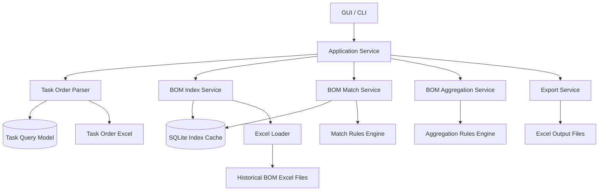
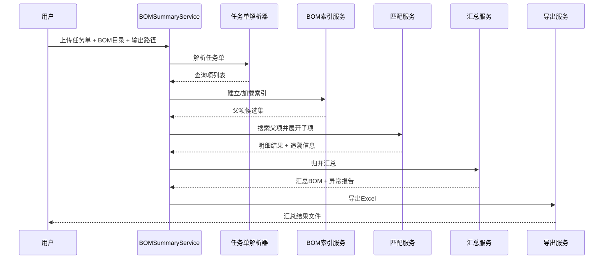

# BOM 汇总技术方案

## 1. 现状架构分析

### 1.1 当前系统形态
当前仓库是一个 **Python 单体桌面工具**，核心文件为 `bom_searcher.py`，同时提供：
- Tkinter 图形界面
- CLI 命令行入口
- Excel 读取、索引、搜索、汇总、导出能力
- 基于 `openpyxl` 的 `.xlsx/.xlsm/.xltx/.xltm` 读取
- 基于 Excel COM 的 `.xls` 转换兼容

### 1.2 当前核心流程
现有主流程集中在 `run_search()`：
1. 读取待查 Excel，抽取查询图号 `collect_queries()`
2. 扫描 BOM 文件夹，收集 Excel 文件 `collect_workbook_paths()`
3. 逐个读取工作簿并建立图号索引 `build_index()`
4. 按图号搜索父项并抽取子项 `search_queries()` + `extract_children()`
5. 导出结果 Excel `write_output()`

### 1.3 当前系统优点
- 已有可运行产品，用户路径短
- 对 Excel 表头容错较高，支持别名匹配
- 已有基本测试，覆盖关键父子提取规则
- 本地运行，无网络依赖，适合工厂/办公室环境

### 1.4 当前系统痛点
当前实现已经能做“BOM 搜索”，但对“任务单物料汇总成新 BOM”还不够：
1. **单文件单脚本**：UI、解析、索引、搜索、导出全部耦合在一起，扩展困难
2. **结果以明细为主**：当前输出是“查到什么就原样拉出来”，缺少跨来源 BOM 的统一汇总视图
3. **无结构化中间层**：没有标准化实体模型，不利于后续做合并、去重、规则扩展
4. **索引是一次性内存索引**：适合小规模，但大 BOM 目录增大后会变慢
5. **没有统一冲突处理策略**：相同图号在多个 BOM 中出现时，只是全部返回，没有优先级和冲突标记
6. **缺少任务语义**：当前输入是“按图号搜索”，目标需求更接近“按任务单生成汇总 BOM”

---

## 2. 目标能力定义

## 2.1 业务目标
新增“**BOM 搜索与汇总**”能力：
- 输入一个任务单 Excel
- 从历史 BOM 库中找到对应父项及其子件
- 将多个来源 BOM 的物料展开、归并、汇总
- 形成一个新的任务 BOM
- 同时保留追溯信息、冲突信息、未命中信息

## 2.2 新能力输出目标
建议输出 4 类结果：
1. **汇总BOM**：最终可用于生产/采购的去重汇总结果
2. **展开明细**：每个任务项展开到了哪些来源子项
3. **匹配追溯**：每条汇总项来自哪些文件/工作表/父子关系
4. **异常报告**：未匹配、重复匹配、数量异常、字段冲突

---

## 3. 总体技术架构

## 3.1 推荐落地策略
基于当前仓库规模与使用场景，建议采用 **分阶段架构**：

### 阶段 A：本地单机增强版（推荐立即实施）
- 保留 Python 技术栈
- 保留 Tkinter GUI + CLI
- 将单文件重构为分层模块
- 引入本地结构化缓存（SQLite）
- 新增“汇总引擎”

### 阶段 B：企业协作版（未来可选）
若后续需要多人协作、权限管理、在线查询、任务历史，则升级为：
- 前端：Next.js
- 后端：FastAPI / NestJS（二选一，若延续 Python 算法建议 FastAPI）
- 数据库：PostgreSQL
- 异步任务：Celery/RQ + Redis
- 部署：Docker + Kubernetes

> 结合当前代码现状，**短期最优选型是 Python + openpyxl + SQLite**，而不是直接重做成微服务。

## 3.2 目标分层架构（阶段 A）



## 3.3 模块边界

### 表现层
- `ui/desktop_app.py`：Tkinter 界面
- `cli/main.py`：命令行入口

### 应用层
- `application/bom_summary_service.py`
  - 编排完整流程
  - 接收输入参数
  - 返回任务执行摘要

### 领域层
- `domain/models.py`
  - QueryItem
  - BomRow
  - BomGroup
  - AggregatedItem
  - MatchTrace
  - ExceptionRecord
- `domain/matcher.py`
  - 图号匹配、父子提取
- `domain/aggregator.py`
  - 数量换算、归并、去重、冲突标记
- `domain/rules.py`
  - 匹配优先级、归并键、异常规则

### 基础设施层
- `infra/excel_reader.py`
- `infra/index_repository.py`
- `infra/sqlite_cache.py`
- `infra/exporter.py`
- `infra/xls_converter.py`

---

## 4. 数据流设计



### 关键数据流说明
1. **任务单 -> 查询项**
   - 从任务单提取 `序号/图号/名称/数量`
2. **历史 BOM -> 父项索引**
   - 对 BOM 库建立按 `drawing_base` 的索引
3. **查询项 -> 匹配组**
   - 一个查询项可能匹配多个 BOM 来源
4. **匹配组 -> 展开明细**
   - 提取父项下属子项、空序号说明行、非标准子序号行
5. **展开明细 -> 汇总 BOM**
   - 按统一归并键聚合数量、保留来源追踪
6. **汇总结果 -> 输出文件**
   - 同时输出汇总视图和可追溯明细

---

## 5. 核心算法设计

## 5.1 统一匹配模型
当前系统已通过 `extract_drawing_base()` 实现图号标准化，这是正确方向。建议保留并扩展：

### 图号标准化规则
输入：
- `101002000250（248010310）`
- `101002000250(248010310)`
- `101002000250 `

统一输出：
- `drawing_raw`：原始展示值
- `drawing_base`：主图号 `101002000250`
- `drawing_variant`：括号内变体 `248010310`（可选）

### 作用
- `drawing_base` 用于主匹配
- `drawing_variant` 用于冲突识别、细粒度版本区分

---

## 5.2 父子提取算法
当前 `extract_children()` 已支持：
- 自然数父序号范围提取
- 点式层级序号提取
- 非标准序号但处于父项段内的行提取
- 空序号说明行提取

建议升级为明确的段解析器：

### 段解析规则
1. 父项为自然数序号时：
   - 直到下一个自然数序号前的所有有效行均视为该段子项
2. 父项为层级序号时：
   - 仅接受 `parent.` 开头的子序号
3. 空序号但有名称/备注/材质/数量等内容时：
   - 视为说明或附属子项
4. 连续空白行达到阈值时：
   - 视为段终止

### 建议新增输出
父项展开时为每一行打标签：
- `PARENT`
- `CHILD`
- `NOTE`
- `ATTACHMENT`

这样后续汇总时可以控制：
- 仅汇总物料行
- 说明行只出现在展开明细，不进汇总 BOM

---

## 5.3 BOM 汇总算法
这是新增能力的核心。

### 目标
将多个来源 BOM 的展开子项汇总成统一物料表。

### 处理流程
```text
查询项 -> 匹配父项 -> 展开子项 -> 数量折算 -> 标准化 -> 归并 -> 输出汇总BOM
```

### 数量折算规则
当前代码中已有：
- 优先按 `子项总数量 / 父项总数量 * 查询数量` 计算
- 其次按 `子项数量 * 查询数量` 计算

建议正式化为：

```text
if child.total_quantity and parent.total_quantity are valid:
    effective_qty = child.total_quantity * query_qty / parent.total_quantity
elif child.quantity and query_qty are valid:
    effective_qty = child.quantity * query_qty
else:
    effective_qty = null and mark as qty_unresolved
```

### 汇总归并键
建议采用分层归并键：

**一级键（主归并）**
- `drawing_base`
- `material_id`
- `name`
- `material`
- `thickness`

**二级键（冲突拆分）**
- `remark_normalized`
- `drawing_variant`

### 归并策略
- 完全一致：数量累加
- 图号相同但材质/厚度不同：拆分为多条并标记 `SPEC_CONFLICT`
- 图号为空但名称+材质+厚度相同：允许按弱键归并，但标记 `WEAK_MATCH`
- 说明行：不进入汇总 BOM，仅保留在明细/追溯表

### 结果分类
每条汇总项应有 `aggregation_status`：
- `AGGREGATED`
- `CONFLICT_SPLIT`
- `NOTE_SKIPPED`
- `QTY_UNRESOLVED`
- `DUPLICATE_SOURCE`

---

## 5.4 多来源冲突处理算法
当前一个图号可匹配多个 BOM 文件，系统直接全部输出；新方案必须可控。

### 推荐优先级策略
按以下顺序排序候选父项：
1. 文件名与任务单或备注更接近
2. 工作表名为 `BOM` 优先
3. 版本号更新优先（若文件名可解析日期/版本）
4. 父项名称与查询名称相似度更高优先
5. 若仍并列，则全部保留并标记多命中

### 匹配模式建议
提供两种模式：
- `strict`：仅取优先级最高的一组 BOM
- `merge_all`：保留所有来源并统一汇总

默认建议：`merge_all + 明确追溯`

---

## 6. 数据模型设计

## 6.1 领域实体

### QueryItem
```json
{
  "sourceSheet": "任务单",
  "sourceRow": 8,
  "sequence": "12",
  "drawing": "101002000250",
  "drawingBase": "101002000250",
  "name": "支架总成",
  "quantity": "18"
}
```

### BomRow
```json
{
  "workbook": "260118.xlsx",
  "sheet": "BOM",
  "excelRow": 23,
  "rowType": "CHILD",
  "sequence": "1.2",
  "materialId": "",
  "drawing": "101002000251-B",
  "drawingBase": "101002000251-B",
  "name": "弯板",
  "thickness": "T3",
  "material": "06Cr19Ni10",
  "quantity": "2",
  "totalQuantity": "2",
  "remark": ""
}
```

### MatchTrace
```json
{
  "queryDrawing": "101002000250",
  "sourceWorkbook": "260118.xlsx",
  "sourceSheet": "BOM",
  "parentRow": 10,
  "childRow": 11,
  "matchMode": "drawing_base",
  "resultStatus": "MATCHED_CHILD"
}
```

### AggregatedItem
```json
{
  "aggregateKey": "101002000251-B|弯板|T3|06Cr19Ni10",
  "drawing": "101002000251-B",
  "name": "弯板",
  "thickness": "T3",
  "material": "06Cr19Ni10",
  "aggregatedQuantity": "36",
  "sourceCount": 2,
  "status": "AGGREGATED"
}
```

---

## 7. 存储格式设计

## 7.1 输出 Excel 结构
建议从现在的 3 个 sheet 扩展为 5 个 sheet：

### 1）汇总BOM（新增，主输出）
列建议：
- 序号
- 物料ID
- 图号
- 名称
- 厚度
- 材质
- 汇总数量
- 单位（若后续支持）
- 来源数
- 冲突标记
- 备注

### 2）展开明细（升级现有“搜索结果”）
每个任务项展开后的父子明细，保留原有展示习惯

### 3）匹配追溯（升级现有“搜索明细”）
保留：
- 输入任务项
- 来源文件/工作表
- 父项/子项行号
- 匹配状态
- 命中模式

### 4）异常报告（新增）
记录：
- 未命中
- 多重命中
- 数量无法解析
- 图号相同规格冲突
- 非物料说明行跳过

### 5）索引统计（可选）
记录：
- 扫描文件数
- 建索引耗时
- 命中率
- 跳过文件列表

## 7.2 本地缓存格式
建议新增 SQLite 作为索引缓存：

### 表：`bom_file`
- `id`
- `file_path`
- `file_name`
- `file_mtime`
- `file_hash`（可选）
- `indexed_at`

### 表：`bom_row_index`
- `id`
- `file_id`
- `sheet_name`
- `excel_row`
- `row_type`
- `sequence`
- `drawing_raw`
- `drawing_base`
- `name`
- `material_id`
- `material`
- `thickness`
- `quantity`
- `total_quantity`
- `remark`

### 表：`parent_segment`
- `id`
- `file_id`
- `sheet_name`
- `parent_excel_row`
- `parent_drawing_base`
- `segment_start_row`
- `segment_end_row`

### 价值
- 第二次运行可只增量索引变化文件
- 避免每次全量扫描 BOM 库
- 后续可扩展为服务端数据库模型

---

## 8. 接口契约设计

## 8.1 应用服务接口

```python
@dataclass
class SummaryRequest:
    input_file: Path
    bom_folder: Path
    output_file: Path
    match_mode: str = "merge_all"
    aggregate_mode: str = "by_drawing_spec"
    use_cache: bool = True

@dataclass
class SummaryResponse:
    total_queries: int
    total_matches: int
    aggregated_items: int
    not_found_count: int
    conflict_count: int
    output_path: Path
    skipped_files: list[str]
```

```python
def run_summary(request: SummaryRequest, log: Callable[[str], None] | None = None) -> SummaryResponse:
    ...
```

## 8.2 CLI 接口
建议新增：

```bash
python bom_searcher.py \
  --input "任务单.xlsx" \
  --bom-folder "历史BOM目录" \
  --output "汇总结果.xlsx" \
  --mode summary \
  --match-mode merge_all \
  --use-cache true
```

### 参数说明
- `--mode search|summary`
  - `search`：兼容现有行为
  - `summary`：启用 BOM 汇总能力
- `--match-mode strict|merge_all`
- `--use-cache true|false`

## 8.3 未来 HTTP API（若服务化）

### `POST /api/v1/bom/summary`
请求：
```json
{
  "taskOrderFile": "upload-id",
  "bomLibraryPath": "D:/BOM",
  "matchMode": "merge_all",
  "aggregateMode": "by_drawing_spec",
  "useCache": true
}
```

响应：
```json
{
  "jobId": "job_20250328_001",
  "status": "completed",
  "summary": {
    "totalQueries": 120,
    "totalMatches": 108,
    "aggregatedItems": 356,
    "notFoundCount": 12,
    "conflictCount": 8
  },
  "artifacts": {
    "resultFile": ".../summary.xlsx"
  }
}
```

---

## 9. 需要改造的关键点

## 9.1 从单脚本重构为分层模块
当前：
- `bom_searcher.py` 同时包含 UI、解析、索引、算法、导出

建议：
- 保留 `bom_searcher.py` 作为兼容入口
- 将核心逻辑下沉到模块

### 推荐文件拆分
```text
bom_searcher.py                # 兼容入口
app/
  application/
    bom_summary_service.py
  domain/
    models.py
    matcher.py
    aggregator.py
    rules.py
  infra/
    excel_reader.py
    excel_parser.py
    index_cache.py
    exporter.py
    xls_converter.py
  ui/
    desktop_app.py
```

## 9.2 改造点映射到当前函数

### 可保留并迁移的函数
- `normalize_text()`
- `normalize_header()`
- `normalize_sequence()`
- `extract_drawing_base()`
- `parse_decimal()`
- `format_decimal()`
- `detect_header()`
- `make_row_record()`
- `parse_sheet()`
- `maybe_convert_xls()`
- `get_display_total_quantity()`（改造成领域规则）

### 需要升级的函数
- `build_index()`
  - 现状：运行期内存索引
  - 目标：支持 SQLite 缓存 + 增量更新

- `search_queries()`
  - 现状：按图号直接返回候选组
  - 目标：支持候选排序、多来源策略、冲突标记

- `write_output()`
  - 现状：输出 3 个 sheet
  - 目标：输出 4~5 个 sheet，并增加汇总BOM主表

- `run_search()`
  - 现状：搜索导出流程
  - 目标：拆成 `run_search()` 与 `run_summary()` 双模式

### 需要新增的函数/服务
- `build_parent_segments()`：预先计算父子段
- `resolve_match_candidates()`：处理多来源命中优先级
- `aggregate_rows()`：归并汇总核心服务
- `build_trace_records()`：构建来源追溯
- `build_exception_records()`：异常归档
- `write_summary_sheet()`：输出汇总 BOM
- `write_exception_sheet()`：输出异常报告

---

## 10. 安全性、性能、可扩展性方案

## 10.1 安全性
虽然当前是本地工具，仍建议最小化风险：
- 限制仅扫描用户选定目录
- 跳过临时文件 `~$` 与结果文件，避免自扫描
- `.xls` 转换使用隔离临时目录
- 记录跳过文件原因，避免静默失败
- 后续若服务化，需要增加：
  - 文件类型白名单
  - 上传体积限制
  - 路径穿越防护
  - 任务级审计日志

## 10.2 性能
当前瓶颈主要在：
- 全量递归扫描
- 每次都重新读取全部 Excel
- Excel I/O 多

### 优化建议
1. **SQLite 索引缓存**：避免重复全量读取
2. **增量索引**：按 `mtime/hash` 只更新变化文件
3. **分阶段内存释放**：读取一个文件即写索引，避免堆积 workbook 数据
4. **预构建 parent segment**：搜索时无需反复扫描上下文
5. **导出流式写入**：当结果很多时可切换 `write_only` 模式

## 10.3 可扩展性
建议设计为规则可插拔：
- 图号匹配规则可扩展
- 汇总归并规则可配置
- 输出模板可扩展
- 来源优先级策略可配置

---

## 11. 风险点与应对

| 风险 | 说明 | 应对 |
|---|---|---|
| 非标准表头 | BOM 来源格式不统一 | 继续扩展 `HEADER_ALIASES`，支持配置文件 |
| 父子关系不规范 | 有些 BOM 没有标准序号结构 | 引入段解析器 + 异常标记 |
| 多来源重复命中 | 相同图号在多个文件中存在 | 候选排序 + merge_all/strict 双模式 |
| 数量字段脏数据 | 数量为空、文本化、带单位 | 统一 decimal 解析并记录异常 |
| 说明行误入汇总 | 工艺说明不应计入物料 | 引入 `row_type` 分类并跳过 NOTE |
| 性能下降 | BOM 文件越来越多 | SQLite 增量索引 + 只重建变化文件 |
| `.xls` 依赖 Excel COM | 某些环境没有 Office | 明确降级提示，必要时要求预转 `.xlsx` |

---

## 12. 推荐实施计划

## Phase 1：结构化重构（1~2 天）
- 拆分 `bom_searcher.py`
- 抽离领域模型和服务接口
- 保持现有功能不变
- 补齐现有测试迁移

## Phase 2：新增汇总引擎（2~3 天）
- 实现 `row_type` 分类
- 实现 `aggregate_rows()`
- 新增 `汇总BOM`、`异常报告` sheet
- 增加多来源冲突策略

## Phase 3：本地缓存索引（1~2 天）
- 引入 SQLite
- 实现索引元数据表
- 增量刷新 BOM 索引

## Phase 4：规则完善与回归（1~2 天）
- 增加复杂样例测试
- 补充未命中/多命中/说明行/数量异常测试
- 优化 UI 文案与日志

---

## 13. 建议测试用例补充

现有测试覆盖了基础搜索能力，但新增汇总能力后需至少补充：

1. **同一任务项命中多个 BOM，汇总数量正确**
2. **相同图号但材质不同，不应错误合并**
3. **说明行存在但不应进入汇总BOM**
4. **父项总数量为空时，回退按子项数量折算**
5. **数量无法解析时进入异常报告**
6. **启用 strict 模式时，仅保留优先级最高来源**
7. **SQLite 缓存命中时，结果与全量扫描一致**

---

## 14. 给研发团队的直接结论

### 对后端/核心逻辑开发
- 不建议推翻重写
- 建议以现有 `run_search()` 为基础拆分服务层
- 优先做 `run_summary()` 新流程和 `aggregate_rows()`
- 第二优先级是 SQLite 增量索引

### 对前端/桌面交互
- 在 GUI 增加“运行模式”切换：`搜索模式 / 汇总模式`
- 汇总模式增加：
  - 匹配策略选择
  - 是否启用缓存
  - 导出文件名默认带 `_汇总BOM`

### 对测试
- 以现在 4 个用例为基础，扩展 7 类汇总场景
- 新增端到端样例 Excel 回归测试

---

## 15. 最终推荐方案

**短期可执行方案：**
- 保留 Python 本地桌面工具形态
- 将现有单脚本重构为分层模块
- 新增 BOM 汇总引擎、异常报告、追溯模型
- 引入 SQLite 本地索引缓存提升性能

**中长期升级方向：**
- 若需要多人协作、权限与历史任务，再演进到 Next.js + FastAPI/PostgreSQL + Docker 的服务化方案

这个路径兼顾了：
- **落地速度**：无需大规模重写
- **可维护性**：从脚本演进到分层架构
- **性能**：通过索引缓存解决扩展瓶颈
- **可追溯性**：保留从任务单到来源 BOM 的全链路追踪
- **业务价值**：从“搜索工具”升级为“任务单 BOM 汇总工具”
